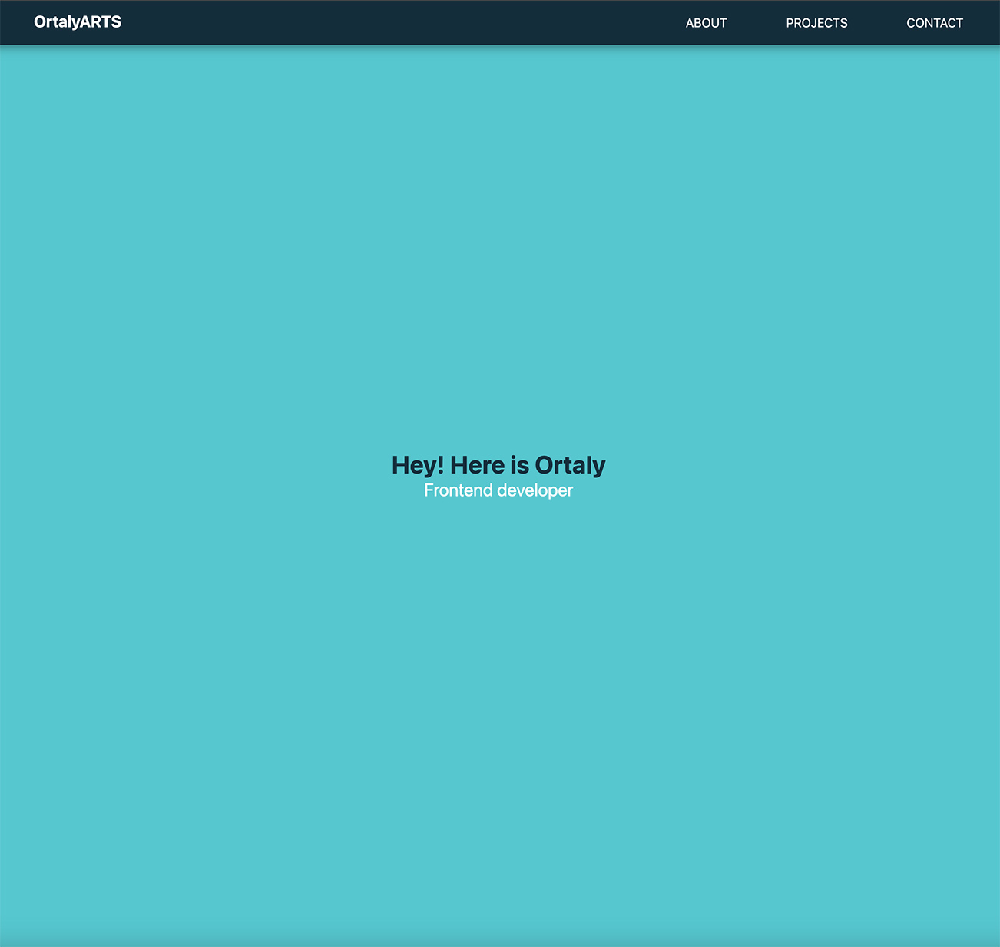

# Free Code Camp - Portfolio Webpage

## Table of contents

- [Overview](#overview)
  - [The challenge](#the-challenge)
  - [Screenshot](#screenshot)
  - [Links](#links)
- [My process](#my-process)
  - [Built with](#built-with)

- [Author](#author)

## Overview

### Screenshot

### Links

- Solution URL: https://github.com/ortalyarts/freecodecamp-personal-portfolio-webpage
- Live Site URL: https://freecodecamp-personal-portfolio-webpage.vercel.app/

## My process

### Built with

- Semantic HTML5 markup
- CSS custom properties
- Flexbox
- CSS Grid
- Mobile-first workflow
- Vanilla Javascript

## Author

- OrtalyARTS

